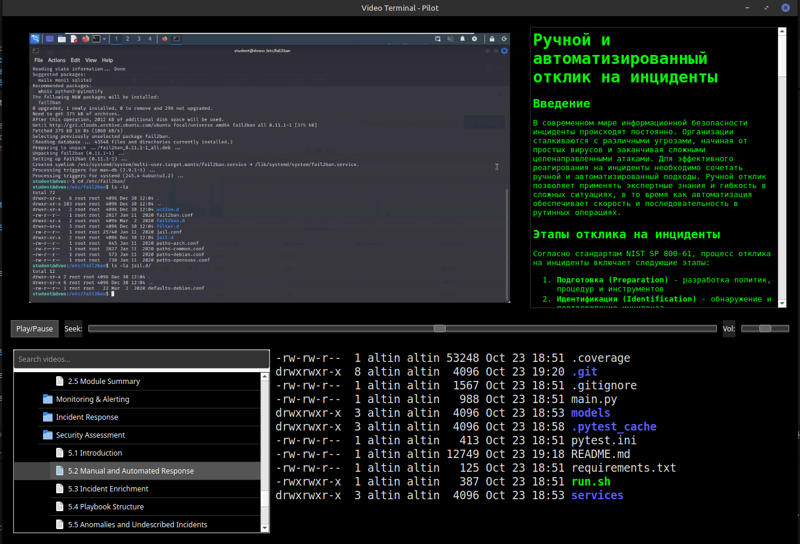

# Video Terminal App / InfoSec Course



This is a simple video player application that shows educational videos, text content, and includes a built-in terminal. It's designed for learning about computer security and programming topics.

## ⚠️ IMPORTANT WARNING: This is NOT a Streaming App

**Videos are downloaded to your computer first, then played!**

- Each video must be fully downloaded before it can play
- Videos can be large (100MB-200MB each)
- Downloads go to your `Downloads` folder and stay on your computer
- You need enough free space and a good internet connection
- First time playing a video may take several minutes to download
- Once downloaded, videos play quickly on subsequent views
- **Smart Prefetching**: When a video starts playing, the app automatically downloads the next video in the playlist in the background (if not already cached), so you can seamlessly continue watching

## What This App Does

The app has 4 main sections:

- **Top Left**: Video player that plays educational videos
- **Top Right**: Text content that explains what's in the videos
- **Bottom Left**: List of available videos you can choose from
- **Bottom Right**: Built-in terminal (command line) for practicing commands

## System Requirements

You need a Linux computer with:

- Ubuntu, Debian, or similar Linux distribution
- Internet connection
- **At least 5GB free space on your hard drive** (videos are large and stored locally)

## Getting the Code

### Step 1: Clone the Repository

First, clone this repository to your computer:

```bash
git clone https://github.com/st93642/InfoSec_Course.git
cd InfoSec_Course
```

This will download all the application code and configuration files.

## Step-by-Step Installation

### Step 2: Install Required System Software

Open a terminal and run these commands one by one:

```bash
sudo apt update
sudo apt install -y python3 python3-pip vlc xterm python3-full python3-venv
```

This installs Python, video player software, and terminal emulator.

### Step 3: Install Python Libraries

Install the required Python libraries (you're already in the InfoSec_Course directory from cloning):

```bash
pip3 install -r requirements.txt
```

This installs:

- **PyQt5**: GUI framework for the application interface
- **python-vlc**: Video playback library for playing videos
- **requests**: HTTP library for downloading videos and content
- **pytest** and related tools: Testing framework (for development)

## How to Run the App

### Method 1: Using the Launcher Script (Easiest)

1. Make the launcher script executable (you're already in the InfoSec_Course directory):

   ```bash
   chmod +x run.sh
   ```

2. Run the app:

   ```bash
   ./run.sh
   ```

### Method 2: Direct Python Run

Run the app directly with Python 3 (you're already in the InfoSec_Course directory):

```bash
python3 main.py
```

## How to Use the App

1. When the app opens, you'll see the main window with 4 sections
2. Click on a video in the playlist (bottom left) to select it
3. **The video will download first** (this may take several minutes for large videos)
4. Once downloaded, the video will start playing automatically
5. Use the play/pause button to control playback
6. The text content (top right) will show information about the video
7. The terminal (bottom right) lets you practice commands while watching

### Terminal Font Size

```bash
# Set terminal font size (default: 14)
export TERMINAL_FONT_SIZE="16"
```

### Example: Run with custom terminal colors

```bash
export TERMINAL_BG_COLOR="#002B36"    # Solarized dark background
export TERMINAL_FG_COLOR="#93A1A1"    # Solarized light text
export TERMINAL_CURSOR_COLOR="#DC322F" # Solarized red cursor
./run.sh
```

## Controls

- **Play/Pause Button**: Click to start or stop the video
- **Seek Slider**: Drag to jump to different parts of the video
- **Volume Slider**: Adjust the sound level
- **Progress Bar**: Shows download progress for videos

## Troubleshooting

### App Won't Start

**Problem**: You see an error when trying to run the app

**Solutions**:

1. Make sure you installed all system requirements:

   ```bash
   sudo apt install -y python3 python3-pip vlc xterm python3-full python3-venv
   ```

2. Install Python libraries:

   ```bash
   pip3 install -r requirements.txt
   ```

3. Try running with Python 3 specifically:

   ```bash
   python3 main.py
   ```

### "externally-managed-environment" Error

**Problem**: You see this error when running the app:

```text
error: externally-managed-environment

× This environment is externally managed
╰─> To install Python packages system-wide, try apt install
    python3-xyz, where xyz is the package you are trying to
    install.
```

**Solutions**:

This error occurs on newer Ubuntu/Debian systems with Python 3.11+. The system Python is protected from pip installs.

1. Install the full Python environment:

   ```bash
   sudo apt install -y python3-full python3-venv
   ```

2. Remove any existing broken virtual environment:

   ```bash
   rm -rf venv
   ```

3. Run the app using the launcher script:

   ```bash
   ./run.sh
   ```

The launcher script will create a proper virtual environment and install dependencies correctly.

### Video Won't Play

**Problem**: Video downloads but won't play

**Solutions**:

1. Make sure VLC is installed:

   ```bash
   sudo apt install -y vlc
   ```

2. Check if the video file downloaded to your Downloads folder
3. Try restarting the app

### Terminal Not Working

**Problem**: The built-in terminal section is blank or not responding

**Solutions**:

1. Make sure xterm is installed:

   ```bash
   sudo apt install -y xterm
   ```

2. The terminal should work automatically when the app starts

### App Runs But Looks Wrong

**Problem**: Windows don't appear correctly or text is cut off

**Solutions**:

1. Make sure you're running on a Linux desktop (not server)
2. Try resizing the main window
3. Restart the app

### Videos Don't Download

**Problem**: Clicking videos doesn't start download

**Solutions**:

1. Check your internet connection
2. **Make sure you have enough free space (at least 5GB recommended)**
3. Videos download to your Downloads folder automatically
4. **Large videos may take several minutes to download**
5. Watch the progress bar at the bottom to see download status

## Getting Help

If you run into problems:

1. Check the terminal output for error messages
2. Make sure all installation steps were completed
3. Try restarting your computer and running the app again

## What Gets Downloaded

**⚠️ Videos are stored permanently on your computer!**

- Videos are downloaded to your `Downloads` folder and stay there
- Each video can be 100MB-200MB in size
- Text content is also saved to your Downloads folder
- The app remembers what you've downloaded for faster loading next time
- **You can delete downloaded videos from your Downloads folder to free up space**

## Course Content & Playlist

The app automatically loads **725 educational videos** from the GitHub repository, organized into **13 releases** with **95+ sections**. Here's the complete course structure:

### Complete Course Playlist Structure

#### Release 1.0.0 - Linux Basics & Terminal

**35 videos** across **5 sections**

- Terminal & Shell: 6 videos
- Devices: 3 videos
- Storage Management: 4 videos
- File Systems: 3 videos
- Linux Introduction: 19 videos

#### Release 2.0.0 - Linux System Administration

**73 videos** across **11 sections**

- Linux Administration: 9 videos
- System Management: 9 videos
- Network Configuration: 11 videos
- Security: 11 videos
- Services: 4 videos
- Monitoring: 12 videos
- Backup: 12 videos
- Troubleshooting: 2 videos
- Advanced Topics: 1 video
- Forensics: 1 video
- Covering Tracks: 1 video

#### Release 3.0.0 - Network Security & Monitoring

**39 videos** across **6 sections**

- Network Fundamentals: 10 videos
- Network Protocols: 10 videos
- Network Design: 10 videos
- Network Services: 5 videos
- Security Implementation: 3 videos
- Monitoring & IDS: 1 video

#### Release 4.0.0 - Group Policy & Administration

**43 videos** across **8 sections**

- Local Administration: 6 videos
- Group Policy Management: 7 videos
- Advanced Policies: 6 videos
- Security Policies: 5 videos
- Troubleshooting: 6 videos
- Best Practices: 4 videos
- Integration: 5 videos
- Advanced Configuration: 4 videos

#### Release 5.0.0 - Database Management & SQL

**44 videos** across **5 sections**

- Database Fundamentals: 6 videos
- SQL & MySQL: 22 videos
- Database Design: 5 videos
- Advanced SQL: 5 videos
- Database Administration: 6 videos

#### Release 6.0.0 - Python Programming Fundamentals

**65 videos** across **13 sections**

- Python Introduction: 4 videos
- Basic Programming: 4 videos
- Data Structures: 7 videos
- Control Flow: 4 videos
- Functions: 5 videos
- File Operations: 6 videos
- Error Handling: 5 videos
- Advanced Topics: 5 videos
- Libraries: 5 videos
- Loops & Iteration: 5 videos
- String Processing: 5 videos
- Data Processing: 5 videos
- Project Development: 5 videos

#### Release 7.0.0 - Information Security Processes

**23 videos** across **5 sections**

- Process Fundamentals: 5 videos
- Security Processes: 4 videos
- Operational Security: 5 videos
- Incident Management: 5 videos
- Compliance Processes: 4 videos

#### Release 8.0.0 - Active Directory & Access Management

**79 videos** across **13 sections**

- Access Management: 1 video
- Active Directory Fundamentals: 8 videos
- User Management: 10 videos
- Group Management: 6 videos
- Security Policies: 2 videos
- Advanced Configuration: 7 videos
- Troubleshooting: 4 videos
- Best Practices: 5 videos
- Integration: 7 videos
- Active Directory Services: 8 videos
- Monitoring: 7 videos
- Backup & Recovery: 8 videos
- Migration: 6 videos

#### Release 9.0.0 - Security Solutions & Testing

**18 videos** across **4 sections**

- Security Solutions: 6 videos
- Testing Environment: 2 videos
- Security Assessment: 6 videos
- Implementation: 4 videos

#### Release 10.0.0 - Security Solutions & Monitoring

**51 videos** across **8 sections**

- Security Solutions Overview: 5 videos
- Threat Modeling: 7 videos
- Monitoring & Alerting: 5 videos
- Incident Response: 7 videos
- Security Assessment: 7 videos
- Implementation: 5 videos
- Testing & Validation: 8 videos
- Best Practices: 7 videos

#### Release 11.0.0 - Information Security Compliance

**25 videos** across **6 sections**

- Compliance Framework: 5 videos
- Threat Modeling: 4 videos
- Risk Assessment: 4 videos
- Security Controls: 4 videos
- Audit & Compliance: 4 videos
- Legal Aspects: 4 videos

#### Release 12.0.0 - Application Security Analysis

**49 videos** across **8 sections**

- Security Analysis Fundamentals: 6 videos
- Web Application Security: 6 videos
- Advanced Security Testing: 7 videos
- Penetration Testing: 6 videos
- Security Assessment: 5 videos
- Reporting & Documentation: 8 videos
- Security Tools: 5 videos
- Case Studies: 6 videos

#### Release 13.0.0 - Git, Python & Network Programming (Bonus)

**181 videos** across **3 sections**

- Git Version Control: 46 videos
- Python Programming: 93 videos
- Network Security: 42 videos

---

## Summary

725 videos across 13 releases with 95+ sections

### Recommended Learning Paths

**Beginners** - Start with foundational Linux and Python skills:

1. Linux Basics & Terminal (35 videos)
2. Linux System Administration (73 videos)
3. Python Programming Fundamentals (65 videos)

**System Administrators** - Focus on system management and infrastructure:

1. Linux System Administration (73 videos)
2. Network Security & Monitoring (39 videos)
3. Group Policy & Administration (43 videos)
4. Active Directory & Access Management (79 videos)

**Security Professionals** - Study comprehensive security concepts:

1. Information Security Processes (23 videos)
2. Security Solutions & Testing (18 videos)
3. Security Solutions & Monitoring (51 videos)
4. Information Security Compliance (25 videos)
5. Application Security Analysis (49 videos)

**Developers** - Learn programming and application security:

1. Database Management & SQL (44 videos)
2. Python Programming Fundamentals (65 videos)
3. Application Security Analysis (49 videos)
4. Git, Python & Network Programming (181 videos)

### Playlist Features & Organization

The playlist displays content with **folder icons** for releases/sections and **file icons** for individual videos. Use the **search box** at the top to quickly find specific topics or videos by typing keywords.

Each video includes:

- **Clean, descriptive titles** (no technical file extensions or version tags)
- **Hierarchical organization** by release and section
- **Text content** with detailed explanations
- **Terminal integration** for hands-on practice
- **Progress tracking** across sections and releases

## Safety Notes

- This app only downloads from the specified GitHub repository
- All downloads go to your Downloads folder
- No personal information is sent anywhere
- The terminal is just for learning - be careful with commands you type
